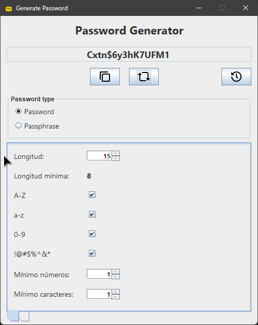
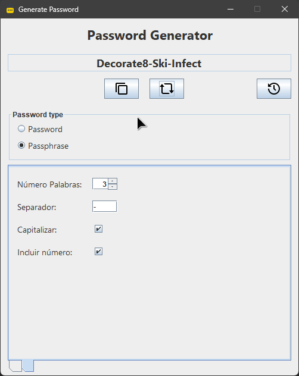
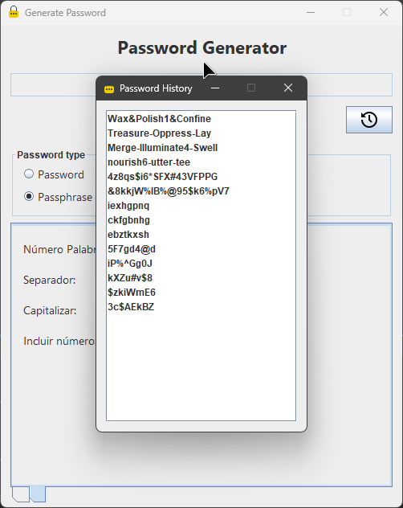

  <h1 align="center"><a href="https://github.com/ASJordi/PasswordGenerator">Password Generator</a></h1>

  
Desktop Password Generator App

## About :computer:

This is a desktop application that generates a random password or passphrase based on the user's preferences. The user can choose the length of the password, the characters that it will contain, and whether it will have uppercase, lowercase, numbers, and special characters.

## Features :sparkles:

- Generate a random custom password or passphrase.
- Copy the generated password to the clipboard.
- Save the generated password to a file.
- Keep track of the used passwords or passphrases.

## Technologies :gear:

* Java SE 21
* Java Swing
* Java IO
* SLF4J

## Dependencies :package:

* [Datafaker](https://github.com/datafaker-net/datafaker) - A Java library to generate fake data.

## Installation :floppy_disk:

1. Clone the repository.
2. Open the project in NetBeans.
3. Install the dependencies.
4. Run the project.

## License :page_facing_up:

Distributed under the MIT License. See `LICENSE` for more information.

## Contact :email:

Jordi Ayala - [@ASJordi](https://twitter.com/ASJordi)

Project Link: [https://github.com/ASJordi/PasswordGenerator](https://github.com/ASJordi/PasswordGenerator)